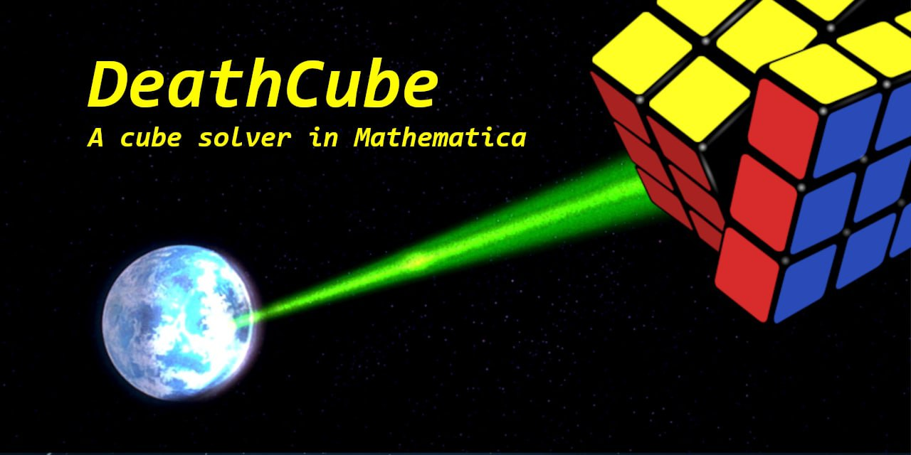

# DeathCube

Balugani Lorenzo - Benetton Alessandro - Cosenza Alessandra - Crespan Lorenzo - Li Zhiguang - Mazzocato Luca

## Progetto per il corso di Matematica Computazionale A.A 2021/2022

### Known Bugs
- On most linux based platforms, the 3D cube does not render. To fix this run _Mathematica_ with the `--mesa` rendering option: ```mathematica --mesa```

## The Rubik Cube
The Rubik's Cube is a classic puzzle game in which the player is tasked to un-scramble a scrambled cube, composed of 26 smaller cubes (cubelets) that have colored faces, in such a way that every face is made by cubelets of the same color. These cubelets will be referred, according to their classification, as:
- **Centers**: centers only have a single visible face, and they are in a fixed position.
- **Edges**: edges have two visible faces;
- **Corners**: corners have three visible faces

## About this project
This project was developed as part of the course in Computational Mathematics at the University of Bologna, AY 2021 - 2022, and its aim is to show and teach users how to navigate and solve the Rubik's Cube. 
Entirely written in Mathematica, the project spans over 6 different modules, and the load of the work was split among the six different members of the team: while sizeable, since the task at hand was quite the undertaking, everyone was fully involved in all of the development phases.
In order to keep everyone updated on the state of the project, tools such as Atlassian Jira and Git were used (and were more times than one lifesavers).
### Modules
#### CubeAcquire
CubeAcquire is the module that handles interactions with the user in terms of cube configuration input. This can be done in both a graphical and textual approach: while the first is more comfortable and immediate, the latter makes the application accessible.
The input is checked to preemptively locate invalid input cubes by confronting the input cubelets with the ones from a solved and correct cube.
#### CubeAnimate
CubeAnimate is the module that handles cube animations.
In order to animate the cube, a list of moves must be set, and then they can be accessed using the RubikNext and RubikPrev functions.
The animation is done by the AnimateMove function, which requires as parameters the move to be animated and the number of animation frames, and the rotations of the layers is accomplished with rotation matrices.
#### CubeColors
CubeColors is the module that handles the conversions between colors and letters.
Since we wanted to have our application to be used also by colorblind people, there's the option to have different colors on the faces.
Internally all the modules use a representation-agnostic approach, using letters that the renderer then maps to the correct colour or texture.
#### CubeCore
CubeCore is the heart of the whole package, and does a whole lot of different things:
- Defines the data structure used to describe the cube;
- Keeps track of the moves that have been done on the cube;
- From a string it generates the cubelets;
- Implements the cube manipulation functions, on a layer or on the whole cube;
- Optimizations.
#### CubeSolver
CubeSolver is the module that implements the Beginner's Algorithm in all of its steps. The solution is then optimized by the Core, which means that - for example - 3 consecutive L moves will be replaced by a single L'.
#### CubeVisualize
CubeVisualize is the module that handles the graphical representation of the cube, both in a 2D (Visualize2DCube) and 3D (Visualize3DCube) manner. For compatibility reasons, the rendering engine has been set to use the Mesa renderer, and to the best of our knowledge is not possible to use hardware acceleration.
The "exploded" (or "flattened") 2D view is mainly used for input purposes using the color picker.
In the 3D view, all the cubes are polygonal meshes that are created when the cube is instantiated.
# Difficulties & Challenges
The DeathCube project has been a fun but challenging exercise for the whole team - and most importantly the first big project that any of us has developed in Mathematica. The challenges were many, from understanding how to implement the Beginner's Algorithm in such a way it would use Mathematica's feature set at its fullest to learning how to build, display and animate 3D meshes. All the challenges were completed within deadline, and we are really pleased with how everything turned out.

However, the team encountered unexpected difficulties:
- The Mathematica IDE: the IDE is maybe a bit too limited (if compared with tools such as IDEA from Intellij), and the debugging tools are not as powerful as someone would desire. The stacktrace information is not really helpful either, since it does not display where the issue is;
- Dynamics weird behaviour: dynamics get evaluated only if they are "seen", and seem to act weirdly if in the context of a presentation notebook;

# Sitography
During the development, these sources were consulted by the team:
- [The Mathematica documentation](https://reference.wolfram.com/language/);
- [The Rubik's Cube Puzzle Wiki](https://ruwix.com);
- [Rubik's official guide](https://rubiks.com/solve-it);
- [pglass Python Cube Solver repository](https://github.com/pglass/cube), as a guideline for data structures;
